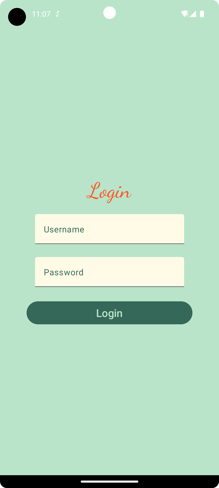

## Boozt QA Technical Chalenge
Congratulations, you have reached the next stage which is solving a Boozt practical chalenge.

During the chalenge execution we want you to imagine yourself as a member of our team, with a collective goal of getting our tasks completed :sunny:

This chalenge include 3 sections: 
Teoretical, Manual testin and Automated testing
execution may take up to 4 hours

Let’s start!

---
### Theoretical part

For that part you don't need any additional devices or apps 
only your knowlage and any text editor 

**Description:** 

You are got a totally new *Login* feature inside of our android app, please describe how you will test it (it is enought to provide a test plan without a concrite testcases )

here is how the feature is look:

---
### Manual part 

**Description :**

We are in the middle of the sprint and the following 2 user stories were just moved to the QA testing column on our Jira board:

####Story 1: As a user I want to log in to the app

Scenarios:

1. **User opens the android app first time (when not logged in yet)**
GIVEN: the user opens app for the first time (when not logged in yet)
THEN: login screen with user name and password entries and login button is displayed

2. **User login failed**
GIVEN: the user provided wrong user name and/or password
WHEN: login button is clicked
THEN: error markers are displayed by user name and/or password entries

3. **User login succeed (credentials provided below)**
GIVEN: the user provided right user name and password
WHEN: login button is clicked
THEN: user is taken to the news screen

4. **User opens app next time (when previously logged in)**
GIVEN:the user opens app next time (when previously logged in)
THEN:user is taken straight to the news screen

####
#### Story 2: As a user I want to see cats breeds

Scenarios:

1. **Cats images are loaded**
GIVEN: the user successfully logged in to the app
WHEN: there is internet connection
THEN: images are displayed in the rows on the list (row can have one or more images scrollable horizontally)

2. **Failed to load images**
GIVEN: the user successfully logged in to the app
WHEN: there is no internet connection
THEN: “failed to load cats breeds” error message is displayed and Retry button

3. **Cats breed card is clicked**
GIVEN: the cats images are successfully loaded on the screen
WHEN: the user clicks one of the image
THEN: user is navigated to the cats breeds details screen with clicked breed info loaded

####Login credentials
**for user1:**  user1 / password
**for user2:**  user2 / password

##

Now it’s your turn. You need to verify if we can move these two tickets to Done column on our Jira board.
We expect that if you will find any bugs , they will be reported in clear form

---
### Automated part 

In this part you need automate at least one scenario from User stories in Manual part 
Recomendation: take the User story 1 and scenario 3

If you will cower more than 1 Senario it will be a bonus

**Description :**

The app code writen on Kotlin language with Compose 
Please use native tools for your test or any other tool of your choosing (but explain why)
Please create your own repo and share the solution with us

* At Boozt we love clean code, so please try to write your tests neatly.

* It’s not mandatory but using an additional abstraction level for your tests (like your own framework to facilitate writing tests) will be very much appreciated

* As a note, we won't consider any automation task submission created with a test recorder.

At Boozt we highly appreciate good communication at all times so, if you have any questions, don’t hesitate to ask

## Good luck :four_leaf_clover:!   